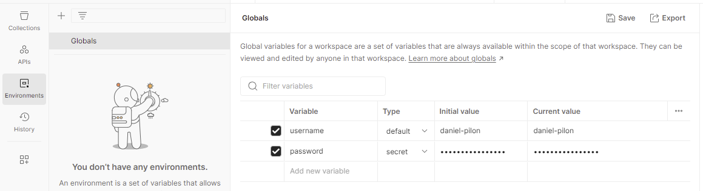

# Introduction

Le programme *test_ddr_api* a pour but d'exécuter les tests de fonctionnalités i.e. les appels aux différents API qui sont un des éléments de base de la 
[Stratégie de tests logiciels de l'équipe du DDR.](https://github.com/federal-geospatial-platform/project_management/tree/main/testing_strategy)

# Postman

Lorsqu'un logiciel contient des point d'entrées pour une ou plusieurs interfaces de programmation d'application (API), 
il est impératif de créer le code qui permettra de tester ces points d'entrées en utilisant la plateforme de tests 
[Postman.](https://www.postman.com/). Une fois les tests terminées et opérationnelles dans Postman vous devez exporter 
ces collections (*.json) et les copier dans le répertoire /newman du répertoire [github](https://github.com/federal-geospatial-platform/project_management/tree/main/testing_strategy). 
Vous devez au besoin mettre à jour le fichier de configuration YAML /python/config.yaml pour inclure cette nouvelle collection 
et recréer le fichier docker.

Si vous devez mettre à jour une collection de points d'entrées existentes, vous devrez importer le ou les fichiers *.json dans Postman. 
Ajouter et/ou mettre à jour les nouveaux points d'entrées et exporter de nouveau le fichier *.json dans le répertoire 
/newman de [github](https://github.com/federal-geospatial-platform/project_management/tree/main/testing_strategy).  

Pour pouvoir être exécuter dans l'environnement Postman la majorité des points d'entrées nécessitent une autentification 
i.e. un nonm d'usager et un mot de passe vers la base de données du DDR. Ces informations sont privés à la personne qui 
développe et sont emmagasinés dans l'environnement des variables Globals de Postman. Deux variables *username* et 
*password* doivent être créés pour contenir les informations permettant de se connecter er d'exécuter les différents 
points d'entrées (voir image ci-dessous).  

**Note importante: Le fichier Globals contant l'autentification pour la base de données ne doit jamais être transféré dans
GitHub car il contient des informations sensibles.**



# Fichier de configuration YAML

Le programme /python/test_ddr_api.py est configurable via un fichier YAML. Cette section décrit le contenu de ce fichier.

 - *mode*: **url_internal** or **url_external** : Utilisation des adresses internes (adresses IP ex.: 10.192.124.185) ou externes pour les appels http;
 - *var_url*: Le nom de la variable d'environnement Postman contenant la racine de l'adresse URL;
 - *to*: Liste d'adresses courriel qui vont recevoir les résultats des requêtes *newman*;
 - *log*: Le nom du répertoire où sera écrit le fichier le fichier (adresse relative ou absolue);
 - collection
     - *nom de la collection*: Le nom du fichier JSON de la collection Postman (sans l'extension .json)
       - *request*: Requête newman qui sera exécutée
       - *var_url*: Nom de la variable de collection contenant url des requêtes (défini dans la partie collection)
       - *url_internal*: Url de la requête interne
    
Vous trouverez ci-dessous un exemple de fichier de configuration YAML

```
mode: url_internal
var_url: environment
to: [bergeronpilon@gmail.com]
log: log_path::API_test.log
collections:
  clip_zip_ship_api:
    request: newman run newman_path::clip_zip_ship_api.json -k -r html,json-summary
    url_internal: http://10.68.130.138:5000
  clip_zip_ship_registry:
    request: newman run newman_path::clip_zip_ship_registry.json -k -r html,json-summary
    url_internal: http://10.68.130.138:5001
  ddr_registry:
    request: newman run newman_path::ddr_registry.json -k -r html,json-summary
    url_internal:  http://10.68.130.138:5021
  ddr_publication:
    request: newman run newman_path::ddr_publication.json -k -r html,json-summary --env-var "publish_file_zip=newman_path::ddr_publisher.zip"
    url_internal:  http://10.68.130.138:5031
```

La configuration du serveur de courriels est contenu dans un document JSON inscrit dans le service de secrets AWS.

# Exécution des tests de fonctionnalités de l'API

## Exécution interactive

Voici les étapes nécessaires pour exécuter interactivement les tests de fonctionnalités de l'API dans l'environnement Windows:

 - Se connecter sur une machine Windows AWS (il est possible d'exécuter le programme sur un ordinateur
de RNCan mais aucun courriel ne pourra être envoyé)
 - Cloner l'environnement github: `git clone https://github.com/federal-geospatial-platform/test_ddr_api.git`
 - Installer les environnemnts Javascript et Newman nécessaires à l'exécution:
   - Télécharger et installer [Node.js](https://nodejs.org/en/download)
   - Installer [Newman](https://github.com/postmanlabs/newman): `npm install -g newman`
   - Installer [Newman Reporter HTML](https://www.npmjs.com/package/newman-reporter-html): `npm install -g newman-reporter-html`
   - Installer [Newman Reporter Summary](https://www.npmjs.com/package/newman-reporter-json-summary): `npm install -g newman-reporter-json-summary`
   - Se placer dans le répertoire `./python`
   - Exécuter la commande `python test_ddr_api.py`

## Exécution avec Docker

Voici les étapes nécessaires pour créer le fichier docker des tests de fonctionnalités de l'API dans l'environnement Windows et ou Linux:

  - Cloner l'environnement github: `git clone https://github.com/federal-geospatial-platform/test_ddr_api.git`
  - Se déplacer dans le répertoire /test_ddr_api
  - Créer l'image docker: `docker build -t test_ddr_api .`
  - Exécuter l'image docker: `docker run test_ddr_api`

Note: 
  - Dans l'environnement Windows, les outils: [Docker Desktop](https://www.docker.com/products/docker-desktop/)et 
[WSL](https://learn.microsoft.com/en-us/windows/wsl/install)) doivent être installés avant de tenter de créer des 
images dockers;
  - Dans l'environnement Linux, l'outil [Docker Engine](https://docs.docker.com/engine/install/ubuntu/) doit être installé. 
avant de tenter de créer des images dockers; 


